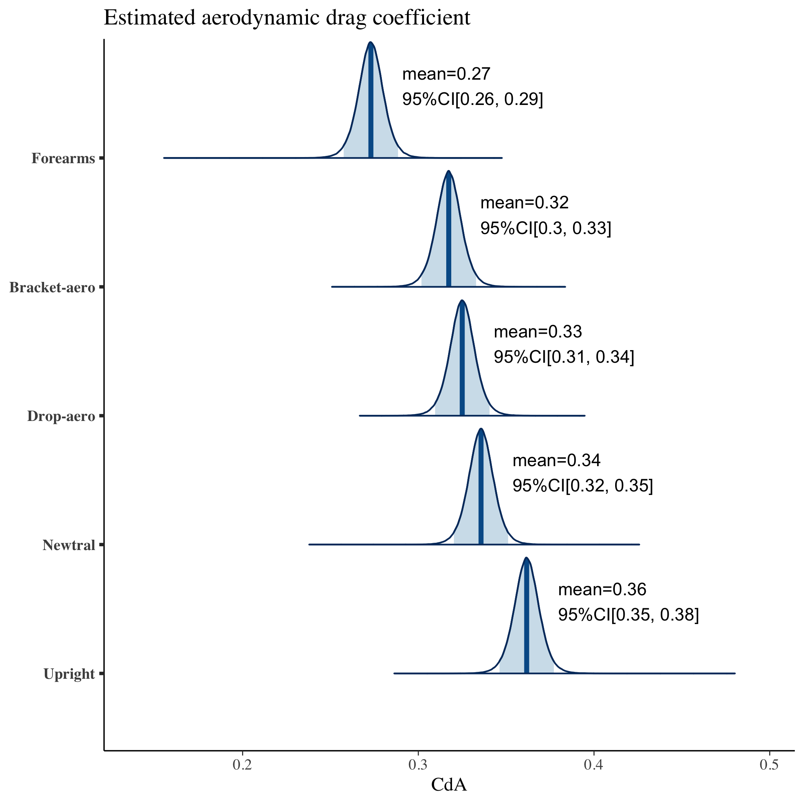
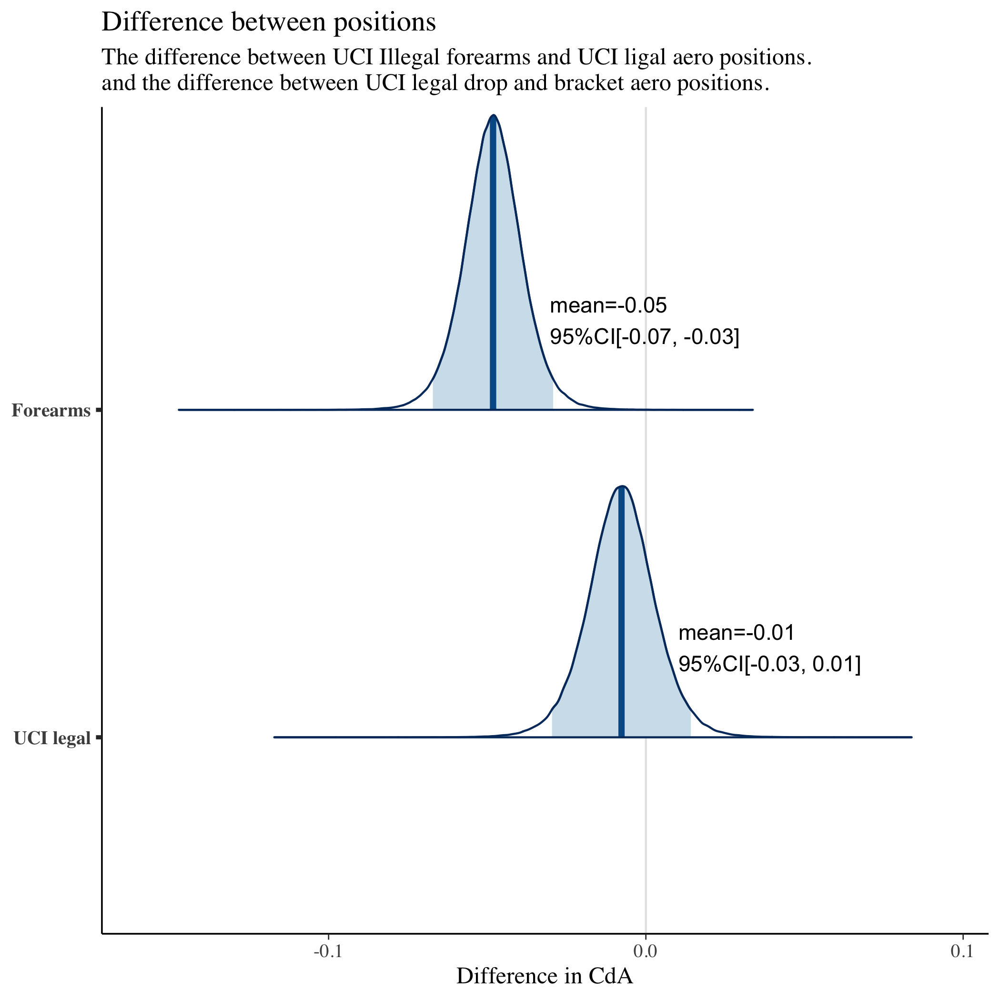

# Forearms-on-bars aero position comparison model

Code for modelling estimated aerodynamic drag(CdA) advantage for __forearms-on-bars__ aero position.

## Installing dependencies

The following packages are required:

```
library(rstan)
library(bayesplot)
library(bridgesampling)

```

## How to run the code

```
Rscript forearms-advantage.R
```

## Results

|    | **Neutral** | **Bracket-aero** | **Drop-aero** | **Upright**  | **Forearms**  |
|----|---------------------------------------|--------------------------------------------|-----------------------------------------|------------------------------------------|------------------------------------------|
| **Model0**<br> mean 95%CI[min, max] | <br>0.35[0.23, 0.49] | <br>0.34[0.23, 0.42] | <br>0.34[0.22, 0.47] | <br>0.37[0.32, 0.41] | <br>0.28[0.20, 0.38] |
| **Model1**<br> mean 95%CI[min, max] | <br>0.34[0.32, 0.35] | <br>0.32[0.30, 0.33] | <br>0.33[0.31, 0.34] | <br>0.36[0.35, 0.38] | <br>0.27[0.26, 0.29] |
| **Model2**<br> mean 95%CI[min, max] | <br>0.34[0.32, 0.35] | <br>0.32[0.30, 0.33] | <br>0.33[0.31, 0.34] | <br>0.36[0.34, 0.38] | <br>0.28[0.26, 0.29] |

|                                     |  Advantage Drop-aero   | Advantage Forearms    |
|-------------------------------------|------------------------|-----------------------|
| **Model0**<br> mean 95%CI[min, max] | <br>0.01[-0.20, 0.18]  | <br>0.06[-0.12, 0.20] |
| **Model1**<br> mean 95%CI[min, max] | <br>-0.01[-0.03, 0.01] | <br>0.04[0.02, 0.07]  |
| **Model2**<br> mean 95%CI[min, max] | <br>-0.01[-0.03, 0.01] | <br>0.04[0.02, 0.06]  |

- Figures have the images with CdA per position, defference between forearms-on-bars and UCI legal position.



