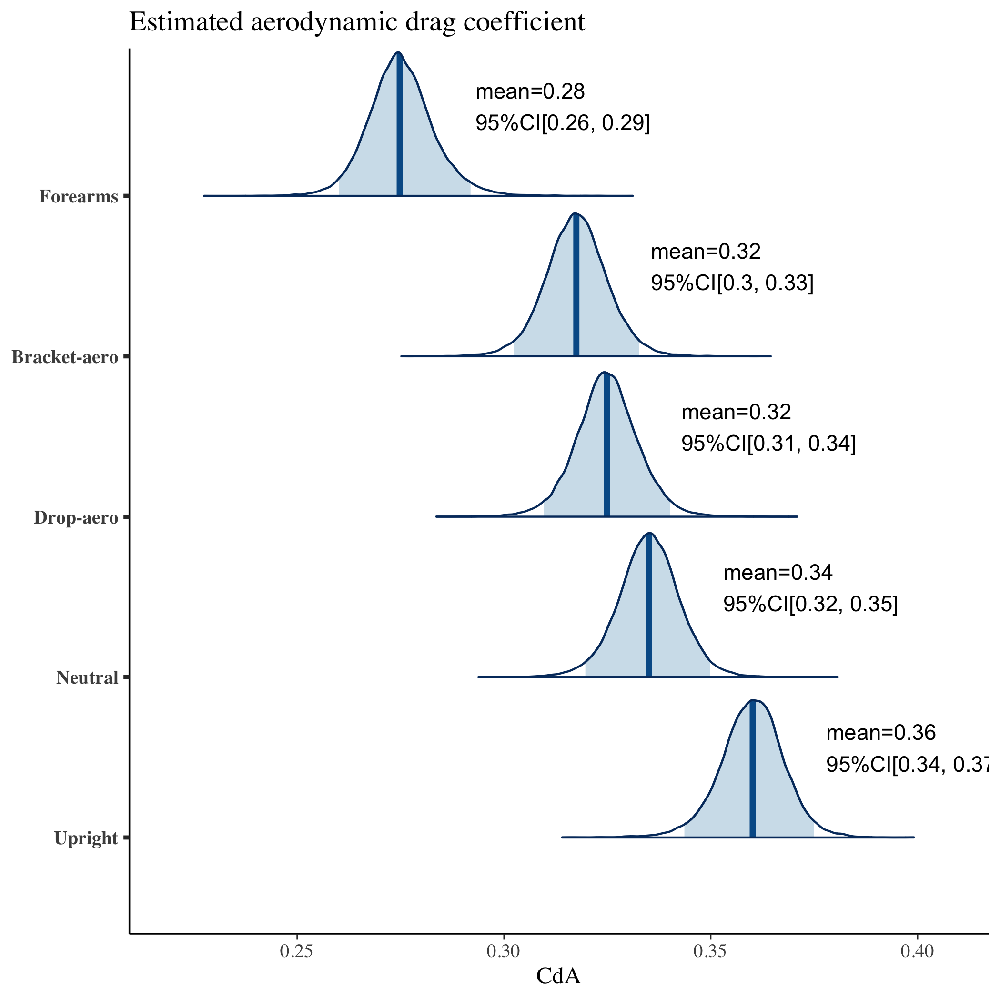
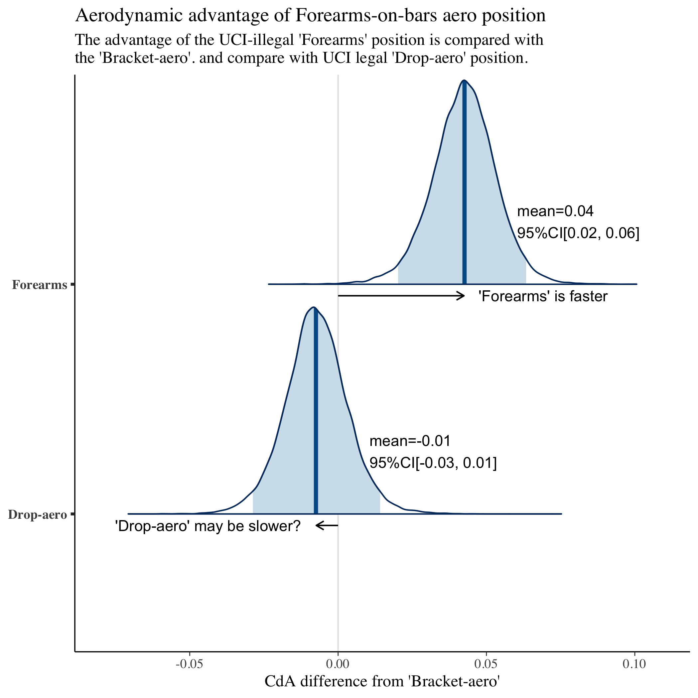

# Forearms-on-bars aero position comparison model

Code for modelling estimated aerodynamic drag(CdA) advantage for __forearms-on-bars__ aero position.

## Installing dependencies

The following packages are required:

```
library(rstan)
library(bayesplot)
```

## How to run the code

```
Rscript forearms-advantage.R
```

## Results

- Figures have the images with CdA per position, defference between forearms-on-bars and UCI legal position.



